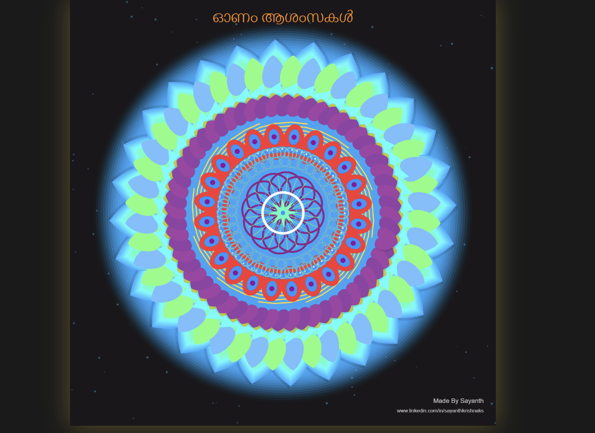
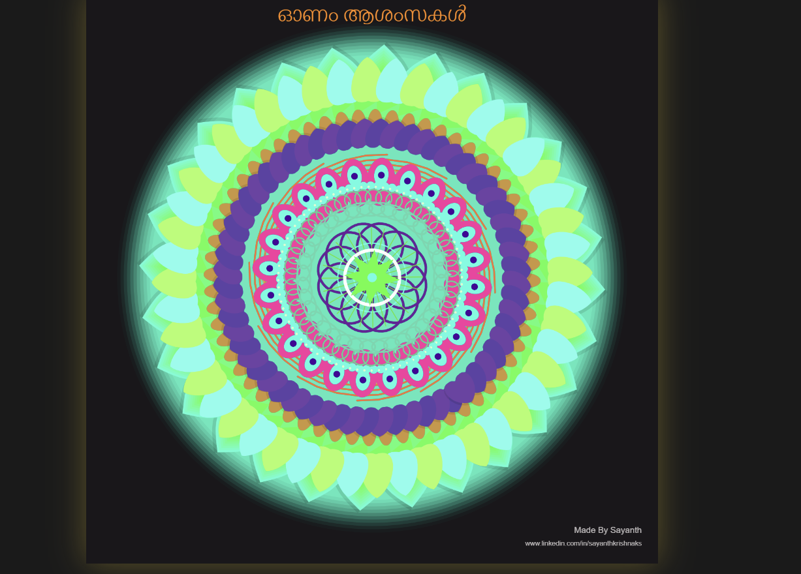
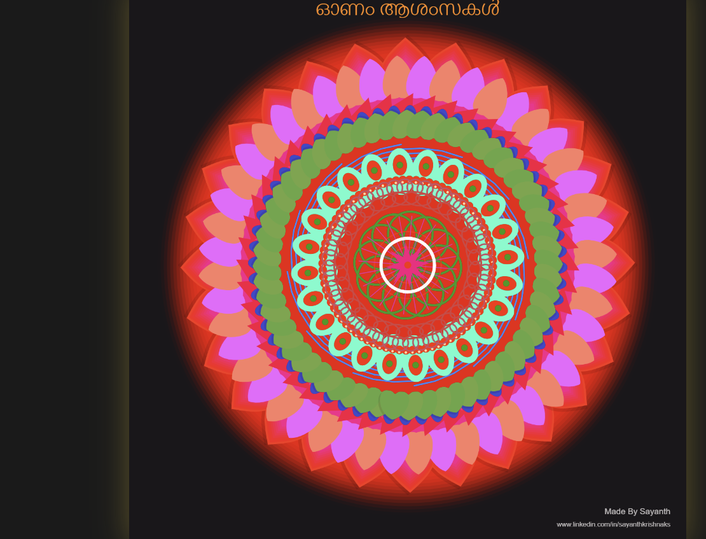
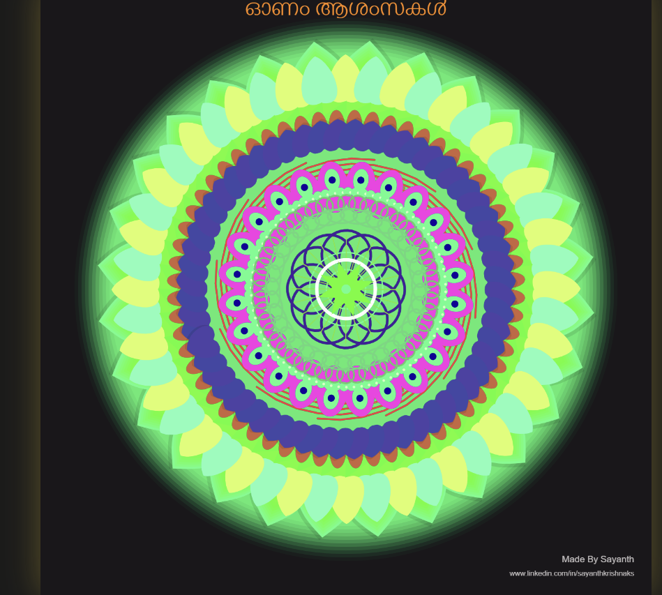
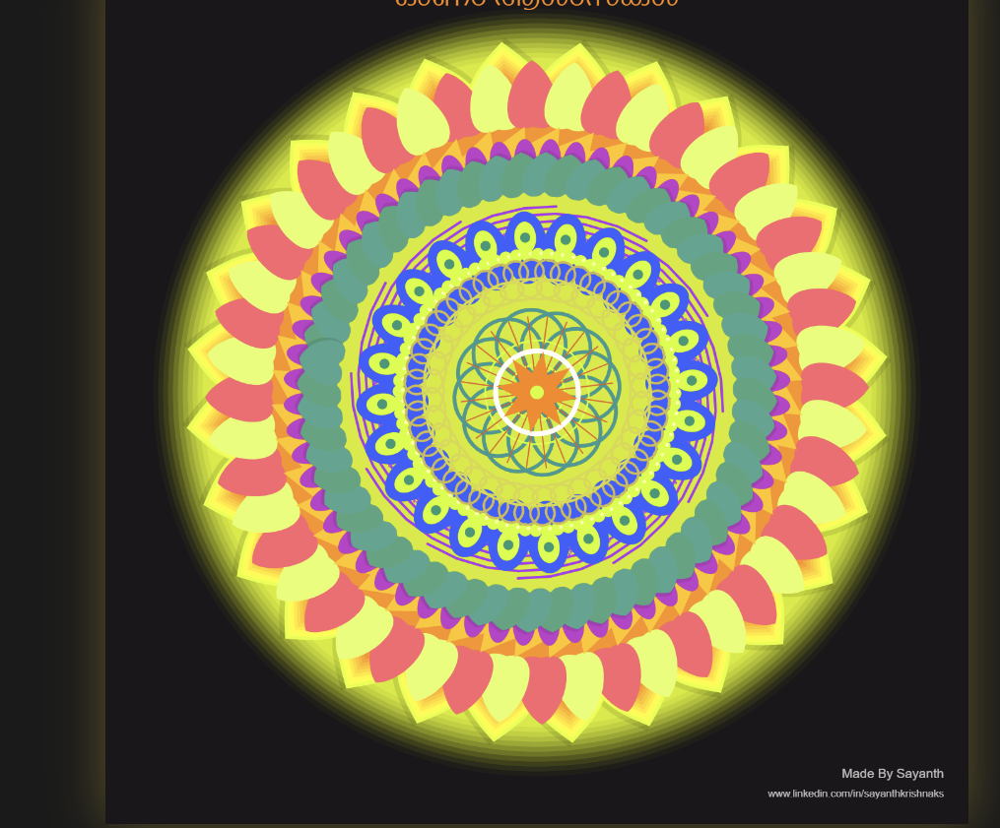

# 🌸 Sayanth's Pookalam 2025 🌸

## 👨‍💻 About Me
- **Name:** SAYANTH KRISHNA KS
- **Institution/Company:** RIT KOTTAYAM
- **GitHub:** https://github.com/Saayaah
- **Programming Language Used:** 

## 🎨 My Pookalam

### Description
This is an interactive digital artwork that reimagines the traditional Onam pookalam as a dynamic one built with 14 layers 

### Preview







### Features
- colour changes in a time period of 6 seconds
- interactive riples on a mouse click

## 🚀 How to Run

### Prerequisites
-no prerequisites

### Running the Code
-just change the file name to index.html and run in your browser
- or directly run using vs code

## 📁 File Structure
```
Code-a-Pookalam-2025/
├── README.md (this file)
├── Pookalamrit.html
└── 1.png,2.png,3.png,4.png,5.png

```

## 🎊 Happy Onam! 🎊
*Submitted for Code-a-Pookalam 2025 by TinkerHub RIT*
```
